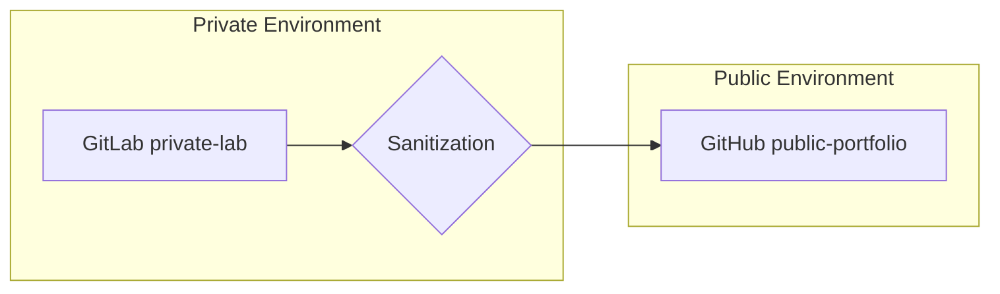

# 🤖 ModelForge-API


API REST profesional para entrenamiento y predicción de modelos de Machine Learning. Diseñada bajo una arquitectura **DevSecOps** que separa el desarrollo privado de la exhibición pública.

## 🛡️ Estrategia DevSecOps

Este repositorio implementa un flujo de trabajo profesional para portafolio:

1.  **GitLab (Source of Truth):** Laboratorio privado completo. Contiene código fuente, tests unitarios, configuraciones de infraestructura y tuberías de CI/CD.
2.  **Sanitización Automática:** Uso del script `scripts/publish_public.ps1` para filtrar componentes sensibles.
3.  **GitHub (Public Portfolio):** Versión sanitizada para exhibición pública. No contiene tests internos, CI/CD, ni configuraciones privadas.

### Flujo de Sincronización


## 🚀 Características

- ✅ **Problemas ML**: Regresión, Clasificación, Clustering.
- ✅ **Algoritmos**: Linear Regression, Logistic Regression, Random Forest, K-Means.
- ✅ **Métricas**: Accuracy, Precision, Recall, F1-Score, RMSE, R².
- ✅ **Validación**: Pydantic para esquemas de datos.
- ✅ **Documentación**: Swagger UI y ReDoc integrados.
- ✅ **Persistencia**: Manejo de modelos en formato serializado.

## 📋 Requisitos

- Python 3.12+
- pip
- Git

## 🛠️ Instalación

```bash
# Sincronización (Solo desde GitLab)
git clone https://gitlab.com/group-data-ia-lab/ModelForge-API.git
cd ModelForge-API

# Crear entorno virtual
python -m venv venv
```

### En Linux / macOS
```bash
# Activar entorno virtual
source venv/bin/activate

# Instalar dependencias de producción
pip install -r requirements.txt

# Instalar dependencias de desarrollo (Testing, Auditoría, Linting)
pip install -r requirements-dev.txt
```

### En Windows
```powershell
# Activar entorno virtual
.\venv\Scripts\Activate.ps1

# Instalar dependencias de producción
pip install -r requirements.txt

# Instalar dependencias de desarrollo (Testing, Auditoría, Linting)
pip install -r requirements-dev.txt
```

## 🏃 Ejecución

```bash
# Modo Desarrollo
uvicorn src.main:app --reload --host 0.0.0.0 --port 8000

# Modo Producción
uvicorn src.main:app --host 0.0.0.0 --port 8000 --workers 4
```

## 🏗️ Arquitectura del Repositorio

- `src/`: Código fuente de la aplicación (FastAPI).
- `tests/`: Suite de pruebas (Exclusivo en GitLab).
- `docs/`: Documentación técnica relevante.
- `diagrams/`: Diagramas de arquitectura.
- `configs/`: Plantillas de configuración (.env.example).
- `scripts/`: Automatización y sanitización.
- `data/`: Almacenamiento local de modelos (ignorado por Git).

## 🔒 Seguridad por Diseño

- **Validación Estricta:** Esquemas Pydantic para prevenir inyecciones.
- **CI/CD Security:** Análisis estático con `bandit` y auditoría de dependencias con `safety`.
- **Sanitización:** Eliminación de artefactos sensibles antes de la publicación pública.

---
*Este proyecto es parte de un ecosistema de desarrollo ético y profesional.*